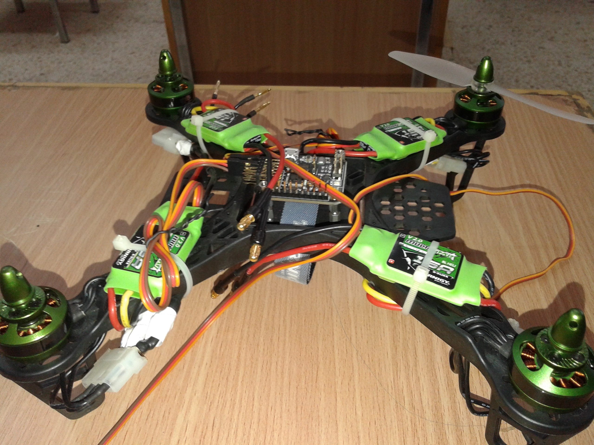
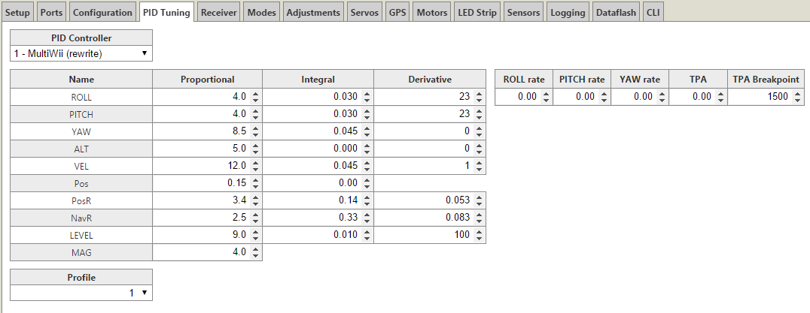

# Crowd-Copter

Crowds of people formed due to either a civil event or an emergency are one of the most vulnerable places which lead to enormous numbers of injuries and deaths among human souls.

The goal of this project is to reduce those regrettable numbers of deaths and injuries by developing a system that consists of a camera fixed on Autonomous Navigatation Flying Robot to capture the scene, which connected to the Raspberry Pi 3 Model B Kit to analyze the captured scenes on the real time. We will be able to guide the people to continue their movement through the right and safe direction without impact or collision.

Our system keeps track of moving keypoints to detect the coherent motion patterns in the scene.
In our project, we implement a Coherent Neighbor Invariance, which characterizes the local spatiotemporal relationships of individuals in coherent motion. This Algorithm can work efficiently on scenes for mobile objects (people, cars, bicycles, animals, ..etc), which gives Coherent Filter many applications in different fields.

However, in this project, the experiments will be concentrated on people motions in crowded places. The figure below shows how Crowd Copter aims to analyz the people motions in the input scene and classified them into different clusters each of them has a unique color.

# Unmanned-Aerial-Robot

### First Demo:

### Final Results:

### Flight Controller (1 PC)

#### I/O
• 6 + 8 PWM I/O can remap as input or output for RC/CPPM/Motors/Servos. Supports varying update rates (50Hz - 32kHz). Direct-drive brushed motors also supported with additional hardware (FETs).
• 8 channel standard PWM RC input
• CPPM (up to 12 channels) RC input
• Second UART accessible for Spektrum Satellite RX or GPS
• MicroUSB connector for firmware updating, configuration and telemetry
• Max 5.5V power via servo connector (rev0-4, rev5acro), Max 16V power via servo connector (rev5)
• Built in FrSky Telemetry converter (rev5)
• Battery voltage monitoring and low-voltage alarm through telemetry/OSD/buzzer
• External buzzer for alarm/user notification
• 2 programmable status LEDs, 1 constant power LED
• One 3.3V and one 5V-tolerant GPIO (rev5)

#### Hardware
• 36x36mm 2 layer pcb, 30.5mm mounting pattern
• STM32F103CxT6 CPU (32bit ARM Cortex M3, 72MHz, 64K/128K flash)
• Invensense MPU6050 3-axis gyro (from rev4 onwards)
• Honeywell HMC5883L digital compass
• MEAS-SPEC MS5611-01BA03 pressure sensor (from rev4 onwards)
• 16Mbit SPI flash memory (rev5)

#### Looptime/Frequency
3500 = 286HZ
3000 = 333HZ
2500 = 400HZ
2000 = 500HZ
1500 = 600HZ

### Electrical Speed Controllers ESCs (4 PCS)
ESCs are a quality speed controller

#### Details: 
• Smooth and linear throttle control 
• Fast response to throttle input 
• Atmel MCU
• Stalled motor protection 
• Throttle signal lose protection 
• Safe power-on (throttle lockout) 
• Support 480Hz+ high refresh rates (up to 499hz) 
• Compatible with programming card

#### Specs:
Constant Current: 30A
Input Voltage: 2-6 cells Lipoly
Frequency: 20-500Hz
BEC: Yes (Switching) [Remove middle wire to disable]
BEC Output: 5V/4APWM: 8 KHz
Max RPM: 240,000rpm for 2 Poles Brushless Motor
PCB Size: 41mm x 24mm
Discharge Plugs: Male 3.5mm Bullet Connector
Motor Plugs: Female 3.5mm Bullet Connector
Weight: 35g
#### [Where to buy](https://hobbyking.com/en_us/turnigy-multistar-30-amp-blheli-multi-rotor-brushless-esc-2-6s-v2-0.html)

### Fight Controller Software
We depends on an Open-Source flight controller software which designed for modern flight boards

### PID Tuning

As we posted looking for information and searched the web. The response was always; “tune your PID’s guys”. But what does that mean? How do you do it? What does the PID mean? Can someone give me PID their PIDS? Help me please?

#### What does the PID mean?
proportional-integral-derivative controller (PID controller) is a control loop feedback mechanism (controller) widely used in industrial control systems. A PID controller calculates an error value as the difference between a measured process variable and a desired setpoint. What the above actually means is that when you move your controller stick, the quad responds, the “PID” checks to see if your quad moved to the desired setpoint of your stick movement. This is interpreted as an error, in which the PID controller attempts to correct and move the craft to the desired position indicated by the sticks. If it did not then it tries to correct that error and establish the correct orientation that you instructed by moving the controller stick. In Angle (self level mode) the PID controls the motors to establish a level stable multirotor.

#### What are PIDs?
The PID controller algorithm involves three separate constant parameters, and is accordingly sometimes called three-term control: the proportional, the integral and derivative values

The P term; the proportional controls the strength of the correction that is applied to bring the craft toward the target angle or rotation rate. If the P term is too low, the craft will be difficult to control as it won’t respond quickly enough to keep itself stable. If it is set too high, the craft will rapidly oscillate/shake as it continually overshoots its target.

The I term; the integral corrects small, long term errors. If it is set too low, the craft’s attitude will slowly drift. If it is set too high, the craft may oscillate (but with slower oscillations than with P being set too high).

The D term; the derivative attempts to increase system stability by monitoring the rate of change in the error. When the P term is changing rapidly, the D term causes the strength of the correction to be backed off. When the P term is stable, the D term is low, allowing the output of the PID controller to move more freely

Understanding impact of P, I and D
P – proportional
P provides a proportional amount of corrective force based upon the angle of error from desired position. The larger the deviation, the larger the corrective force.

A higher P value will create a stronger force to return to desired position.
If the P value is too high, on the return to initial position, it will overshoot and then opposite force is needed to compensate. This creates an oscillating effect until stability is eventually reached or in severe cases, the overshoot becomes amplified and the multirotor becomes completely destabilised.

Increasing value for P:
It will become more solid/stable until P is too high where it starts to oscillate and loose control. You will notice a very strong resistive force to any attempts to move the MultiRotor

Decreasing value for P:
It will start to drift in control until P is too low when it becomes very unstable.
Will be less resistive to any attempts to change orientation

Aerobatic flight: Requires a slightly higher P
Gentle smooth flight: requires a slightly lower lower P

I – Integral
I provides a variable amount of corrective force based upon the angle of error from desired position. The larger the deviation and / or the longer the deviation exists, the larger the corrective force. It is limited to prevent becoming excessively high.

A higher I will increase the heading hold capability

Increasing value for I:
Increase the ability to hold overall position, reduce drift due to unbalanced frames etc

Decreasing value for I:
Will improve reaction to changes, but increase drift and reduce ability to hold position

Aerobatic flight:
Gentle smooth flight:
AP: Requires a slightly lower I to minimize wobbles / jitters

D – Derivative
This moderates the speed at which the MultiRotor is returned to its original position.
A lower D will mean the MultiRotor will snap back to its initial position very quickly

Increasing value for D:
Dampens changes. Slower to react to fast changes

Decreasing value for D:
Less dampening to changes. Reacts faster to changes

Aerobatic flight: Lower D
Gentle smooth flight: Increase D

#### What does it mean to tune your PID?
The “PIDs” are a set of tuning parameters which control the operation of the PID controller. The optimal PID settings to use are different on every craft, so if you can’t find someone with your exact setup who will share their settings with you, some trial and error is required to find the best performing PID settings. Excellent reference provided by joshuabardwell regarding PID tuning

#### Can someone give me their PID settings?
Yes and no.

PID settings can be shared with great success, only if you have the exact same multirotor and power system. If not it may get you close but further tuning will be required. The reason for the differences between PID settings of one multirotor to another includes but is not limited to the following:

Center of Gravity
Motors (size, responsiveness, propellers, balance, angle of the motors)
ESC’s
Frame design & layout(symmetrical, “H” configuration, etc.
Personal preference (racing, acrobatics, FPV, using Acro/Angle/Horzion mode
Your flying ability

#### 1.Tuning procedure
Load default PID values as below:

Change D to 15
Change I to 0.020
#### 2.Establish the flyable range of P
The default value for both Pitch/Roll is 4.0 If you have a square multirotor or you followed the directions above to tune your CMix then you can tune Pitch & Roll together. We’ll assume you have tuned your CMix and or you have a symmetrical multirotor.
Hover your quad and listen and look for high frequency oscillations. Since we have a CMix in place we can adjust both Pitch & Roll P values together.
Increase P value for Pitch & Roll  till you see or hear oscillations. This can be accomplished by hovering the quad, stopping and connecting the computer and changing the values in CleanFlight or by following the procedure above in Prerequisites to setup a switch to increase your P values during flight.
Starting at P=4.0 In this example oscillations were not  visible
P=8.0 none.
P=12.0 oscillations were audible in the motors.
P=16.0 oscillations were visible in the multirotor.
The value of P for both Pitch & Roll are set to 6.0 which is 50% of the range of the P value we established in our testing above. (P=4.0 to 16.0)

#### 3.Basic tuning of I gain
A good test of I gain is to punch out hard, cut the throttle to about 25% and let the quad fall, then punch the throttle hard to arrest the fall. If the quad can maintain solid attitude then the I gain is probably not too low. If you see the angle of the quad changing then you need to increase I gain.
The Pitch axis reacts differently from the Roll axis even though we have set up a CMix to account for the different spacing between motors. The difference is because of the weight distribution along the center of gravity of the Quad. The weight on the Pitch axis is further from the center of gravity then the Roll axis. Therefor you usually require more I gain on the Pitch axis then the Roll axis to account for the unequal weight distribution. (front to back verses side to side)
If you notice your attitude changing when you did not input stick movement, or if you are constantly having to “nudge the copter back onto course”, that’s probably an indication that I is to low on the axis in question.
TIP: you may experience some wondering if your transmitter flutters around center. This can be seen in the receivers tab in CleanFlight. For example with a range of 1000 to 2000, your center will be 1500. Watching the receiver tab in CleanFlight and you see the values jumping around the 1500 mark. Set Deadband in the CLI tab to 2 times the amount of fluctuation observed. For example jumping between 1500 & 1502 Set Deadband = 4
If it is set too high, the craft may oscillate (but with slower oscillations than with P being set too high).
#### 4.Working up P gain (ref: Working up P gain)
In step 2. above we established a P value for a stable hover. Next we want to tweak the P value for actual flight.
Continue raising P gain up till you see oscillations. Also make note of your motor pitch and try to listen for oscillation in your motors.
#### 5.RC Rate, Pitch & Roll Rates
##### Explanations:
1.RC Rate – sets the baseline stick sensitivity when using step1
2.Pitch & Roll Rates –  For PID Controllers 1 and 2, this is an multiplier on overall stick sensitivity, like RC rate, but for roll and pitch independently. Stability (to outside factors like turbulence) is not reduced at stick extremes. A zero value is no increase in stick sensitivity over that set by RC rate above. Higher values increases stick sensitivity across the entire stick movement range.
3.Yaw Rate – In PID Controllers 1-4, it acts as a stick sensitivity multiplier, as explained above.
4.With P and I at close to optimal values, the quad is flyable enough that you should feel confident doing flips and rolls.
5.Adjust expo to give you softness around the center stick but you can still do precision flying.
#### 6.Tuning TPA 
TPA stands for Throttle PID Attenuation. TPA basically allows an aggressively tuned multi-rotor (one that feels very locked in) to reduce its PID gains when throttle is applied beyond the TPA threshold/breakpoint in order to eliminate fast oscillations. TPA applies a PID value reduction in relation to full Throttle. It is used to apply dampening of PID values as full throttle is reached.
In order to determine where your TPA threshold should be, do some drop-and-catch maneuvers (where you cut throttle and let the quad fall, then punch hard to arrest the fall). Try to punch the throttle to a pre-determined position each time, slowly increasing the position until you find out about where the oscillations start to occur. Make a note of the throttle position.
Do some high speed laps, paying attention to the throttle position in which high speed oscillations start to occur.
Set your TPA threshold according to your testing in the 2 steps above. A customary setting is 0.70 which equates to 70% throttle and above.
#### 7.Fine-tuning P & D
When tuning P & I they for the most part tune independently of each other.
Unfortunately, P is interrelated with D, which complicates the search for the best combination of values. Ideally, the way it works is that increased D gain “damps” the effect of P. If P is changing rapidly, D will counteract that change. This means that in cases where P would usually jerk the craft around, overshoot, and oscillate, increased D can reign it in.
Excess D can also manifest as the quad changing altitude spontaneously during hover, even though the throttle hasn’t moved.
 

#### Additional information:
The Roll of the Gyroscope & Accelerometer
##### Gyroscope
A gyroscope measure angular velocity, in other words the rotational speed around the three axis. Acro mode uses only the gyro.

##### Accelerometer
In Simple words the ACC can sense the orientation of the multicopter. It is required for the self-level flight feature. The ACC sensor is also required in the altitude hold feature (along with Baro or sonar), estimates the velocity of the quadcopter in the vertical direction. Autolevel modes (Angle & Horizon) use the gyro and accelerometer. In CleanFlight click on Calibrate Accelerometer in the Setup tab. Make sure you have your multirotor sitting on a level surface prior to calibration.

##### Trim
You can’t trim the transmitter because the sticks are interpreted differently in acro vs. autolevel modes. In acro mode, a stick position corresponds to a rate of angular change (e.g. pitch forward at a rate of 10 degrees per second). In angle mode, a stick position corresponds to a given angular position (e.g. pitch forward 10 degrees from vertical and stay there). So let’s say the stick is trimmed pitch forward to correct backwards drift in autolevel mode. Now you switch to acro mode and the copter will begin to pitch forward and keep pitching forward in a slow front flip.

If you have drift in acro mode, you should work on your tune (e.g. maybe increase I gain, or decrease vibration, or change your soft filters to filter out vibration). If you have drift in autolevel mode, you should use acc trim in the FC to deal with it(see How to trim your Accelerometer below). In theory, if you only ever flew in autolevel mode, you could get away with using transmitter trims, but it’s a bad habit, because the second you switch to acro mode, the copter is going to be much harder to fly.

The exception to this rule is the yaw axis. The yaw axis only ever uses the gyro, even in autolevel modes. So if you have yaw drift, it’s acceptable to tune it out with transmitter trim. But really, you should first try to figure out what’s wrong with your copter or your tune that the FC can’t hold heading reliably, because it’s probably hurting you elsewhere, not just in yaw.

Therefore the correct way to Calibrate is to use Accelerometer trims, which brings us to our next point.

How to trim your Accelerometer
In order to have a stable hover in an Autolevel mode (Angle or Horizon) you need to trim the Accelerometer. If you recall above the Accelerometer is not used in Acro mode. When you activate an Autolevel mode and your multirotor moves you need to trim your accelerometer as detailed below.

### References:

1. [Robotics: Aerial Robotics](https://www.coursera.org/learn/robotics-flight)
2. [Autonomous Navigation for Flying Robots](https://www.edx.org/course/autonomous-navigation-flying-robots-tumx-autonavx-0)
3. [rcgroups](https://www.rcgroups.com)
4. [Oscarliang](https://oscarliang.com)
5. [cleanflight](http://cleanflight.com/)
6. [OpenTX University Cleanflight Tutorial](http://open-txu.org/home/special-interests/multirotor/cleanflight-pid-tuning/)

### Team members:

Mohamad Al Mdfaa
Mohamad.AlMdfaa@yahoo.com

Mhd Hasan Alganadi
mhdhasanaljanady@gmail.com

Ahmad Al Shalabi
ahmad.alshalabi.iot@gmail.com
